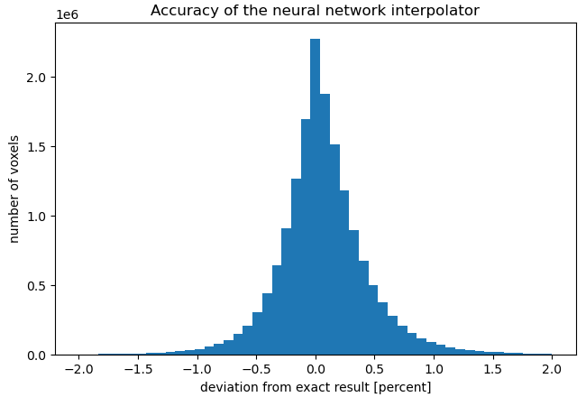

# Voxelize

* [Introduction](#intro)
* [The two flavours of the code](#flavours)
* [Performance and how to tune it](#performance)
* [Accuracy](#accuracy)
* [Dependencies](#dependencies)
* [Building PyTorch](#pytorch)
* [Build](#build)


Author: [Leander Thiele](mailto:lthiele@princeton.edu) with encouragement from Francisco Villaescusa-Navarro

## Introduction <a name="intro"/>

*Voxelize* converts a list of simulation particles which have a field associated with them
into a cubic lattice of voxels.
This can be useful, for example, to measure power spectra and other summary statistics,
as well as to generate data to be used in machine learning applications.

*Voxelize* uses a spherical top-hat kernel for the particle assignments.
Each particle can have an individual value for the radius of this top-hat.
In principle, extension to other kernels should be possible with relatively little modification
of the code; do get in touch if that is would you need.

Mathematically, *Voxelize* computes the field value associated with voxel *i* as

f<sub>i</sub> = &Sigma;<sub>&alpha;</sub> f<sub>&alpha;</sub> V<sub>i,&alpha;</sub> V<sub>voxel</sub><sup>-1</sup>,

where &alpha; indexes the simulation particles, f<sub>&alpha;</sub> is the field associated with them,
V<sub>i,&alpha;</sub> is the overlap volume between voxel *i* and a sphere of radius r<sub>&alpha;</sub>
centered at particle &alpha;'s position, and V<sub>voxel</sub> is the volume of a voxel.
Note that with this definition, intensive fields f<sub>&alpha;</sub> are mapped to intensive fields f<sub>i</sub>,
for example if the input field associated with the particles is the local density,
the output field will be a local density too (and not a mass).

<a name="flavours"/>
## The two flavours of the code

*Voxelize* can be used in two flavours:
* CPU-only;
* CPU+GPU.

The CPU-only version computes the overlap volumes analytically, using a header file provided
by Strobl et al. 2016 (https://github.com/severinstrobl/overlap).
In order to use the CPU-only version, link with lib/libvoxelize\_cpu.a
and include the header [include/voxelize\_cpu.hpp](include/voxelize_cpu.hpp), which declares the function
```C
void voxelize (uint64_t Nparticles, int64_t box_N, int64_t dim, float box_L,
               float * coords, float * radii, float * field, float * box);
```
Here, `box` is an output buffer that can fit at least `box_N`<sup>3</sup> floats,
`dim` is the dimensionality of the field that is to be gridded, and `coords`
(and `field`, if `dim`>1) are in row-major (C) order.
The code *adds* to the `box`, without zeroing first. This has the advantage that
you can repeatedly pass the same `box` for different simulation chunks.
Note that all the `float *` inputs will be modified by the code.

The CPU+GPU version achieves higher performance than the CPU-only version by using a neural network
to interpolate the exact overlap volumes (in principle, the network could also be evaluated on a CPU,
but the performance gain over the exact calculation is small in that case).
In order to use the CPU+GPU version, link with lib/libvoxelize\_gpu.a
and include the header [include/voxelize\_gpu.hpp](include/voxelize_gpu.hpp), which declares the function
```C
void voxelize (..., gpu_handler * gpu);
```
Here, the ellipses stand for the same arguments as in the CPU-only version,
and `gpu_handler` is a class defined in [include/gpu\_handler.hpp](include/gpu_handler.hpp).
The only constructor of this class is declared as
```C
gpu_handler::gpu_handler (const std::string &network_dir);
```
Here, `network_dir` should be a directory that contains the files `network.pt` and `Rlims.txt`.
By default, we provide such a directory in `data/network`.
The `gpu_handler` constructor will load the trained network from disk and move it to the GPU(s).
Since this is a somewhat time-consuming process, the code is written in such a way that you
only need to do this once and can then call the `voxelize` function repeatedly with a
pointer to the same `gpu_handler` instance.

We provide a complete example of how to use the code (in both versions) in [src/example.cpp](src/example.cpp).


<a name="performance"/>
## Performance and how to tune it

For our tests, we used the script [src/example.cpp'](src/example.cpp) This program loads the gas particles
from an Illustris-type simulation and constructs the gas density field.
The simulation has 256<sup>3</sup> gas particles in a 25 Mpc/*h* box, which we assign
to a 256<sup>3</sup> lattice.

Using one GPU (Tesla P100) together with 10 CPUs, the CPU+GPU version performs the task
in about 3.7 seconds (without construction of the `gpu_handler` and disk I/O).

The CPU-only version takes about 10 times longer, on 10 CPUs. It should be noted that
it is a bit difficult to compare performances in this way, since some users may find it
easier to access a large number of CPUs.

The CPU-only version should require no tuning, and should run fine over a range of thread numbers
(it should be larger than 5 or so for good resource utilization, synchronization overhead may
become relevant with a large number of threads).

We found that the CPU+GPU version performs best with 1 GPU and of the order 8-12 CPU-threads.
Although the code supports multiple GPUs in principle, we found that not much performance could
be gained by running on more than one GPU.
A point that may require tuning is the batch size, which you can find in the [include/defines.hpp](include/defines.hpp).
In our tests on a GPU with 16GB memory we found 2<sup>17</sup> to be a good choice.
The user may want to adjust this number proportionally to the memory their GPUs have.
If the number of CPU-threads as well as the batch size are chosen well, utilization metrics
shown by e.g. `nvidia-smi` or `gpustat` will exceed 90% during most of the code's runtime.


<a name="accuracy"/>
## Accuracy

Since the CPU+GPU version uses an interpolator, the results will differ from the analytic calculation
which the CPU-only version performs.
Using the script [src/example.cpp](src/example.cpp), we compared the outputs of the two algorithms.
A histogram of the relative difference between the two results is shown here:



We see that the CPU+GPU version achieves sub-percent accuracy for the vast majority of voxels,
with most of them off by only a few permille.


<a name="dependencies"/>
## Dependencies

Both flavours of the code (CPU-only and CPU+GPU) require the
[Eigen](https://eigen.tuxfamily.org/index.php?title=Main_Page) header files.
We experienced some problems with the, as of writing, most recent version 3.3.9,
we recommend you use v3.3.8 instead.

In order to compile [src/example.cpp](src/example.cpp), hdf5 (with C++ bindings) is required.

For the CPU+GPU version,
* PyTorch (with C++ bindings),
* CUDA (the code is tested with v11.0, but older version should work too),
* CUDNN (optional, depending on how PyTorch was built)

are required.
We found it impossible to link with the pre-built PyTorch binaries that can be found
[here](https://pytorch.org/get-started/locally) (presumably because they used an ancient
GCC version).
If you are facing the same problem, the next section provides some guidance on how to build
PyTorch from source.


<a name="pytorch"/>
## Building PyTorch

**Only required if the CPU+GPU version is desired, and linking with the pre-built binaries fails.**
We found that it was necessary to build PyTorch from source.
This is a bit annoying, but on the plus side you will get a high-quality build
of PyTorch that will most likely be faster than the "many-linux" pre-built binaries.
Here are some instructions (replace `export` with the appropriate command for your shell
if necessary):
1. ```shell
   git clone https://github.com/pytorch/pytorch.git
   ```
   We found that the, as of writing, most recent release-version 1.7.0 has bugs
   related to the FBGEMM part. You may be able to compile that version by setting
   `export USE_FBGEMM=0`, but we recommend building from the main branch.
2. Load a C++ compiler and a CUDA compiler into your `PATH`.
   On Princeton's Tiger machine, that simply means
   ```shell
   module load rh/devtoolset/8 # I think there was an issue with v9 of GCC
   module load cudatoolkit/11.0
   ```
   for `gcc` and `nvcc`.
3. Load some other libraries if necessary, e.g. on Tiger
   ```shell
   module load cudnn/cuda-11.0/8.0.2
   module load fftw/gcc/3.3.4
   module load intel-mkl/2020.1/1/64
   ```
4. Set up a build and install path (they can be identical but we recommend to have them separate)
   ```shell
   mkdir pytorch-build
   mkdir pytorch-install
   cd pytorch-build
   ```
5. Export some environment variables to tell CMake where to find CUDNN,
   e.g. on Tiger
   ```shell
   export CUDNN_INCLUDE_DIR=/usr/local/cudnn/cuda-11.0/8.0.2/include
   export CUDNN_INCLUDE_PATH=/usr/local/cudnn/cuda-11.0/8.0.2/include
   export CUDNN_LIBRARY=/usr/local/cudnn/cuda-11.0/8.0.2/lib64
   export CUDNN_LIBRARY_PATH=/usr/local/cudnn/cuda-11.0/8.0.2/lib64
   ```
   (somehow these are really counterintuitively named and I don't remember which
   ones exactly are important)
6. Load a recent version of CMake, e.g. on Tiger
   ```shell
   module load cmake/3.x
   ```
7. Set some other environment variables
   ```shell
   export CMAKE_INSTALL_PREFIX=../pytorch-install
   export CMAKE_BUILD_TYPE=Release
   export BUILD_SHARED_LIBS=1
   export USE_CUDNN=1
   export _GLIBCXX_USE_CXX11_ABI=1
   export GLIBCXX_USE_CXX11_ABI=1
   ```
   Again, only one of the last two is actually important, I forgot which one.
8. Run CMake:
   ```shell
   cmake ../pytorch > log.txt
   ```
9. Inspect the generated files `log.txt` and `CMakeCache.txt`. In particular, search for
   * `CUDNN`
   * `CUDA`
   * `GLIBCXX_USE_CXX11_ABI`

   and check that everything looks reasonable.
   Other things to look out for are, for example, that the MKL path was identified correctly,
   the correct GCC and NVCC versions were found, etc.
   If something doesn't seem to be right, try to play with the environment variables.
10. Finally, build PyTorch:
    ```shell
    cmake --build . --target install
    ```
    This will take a long time (I think it was like 12 hours on Tiger),
    so maybe do this in a `screen` session so you don't have to keep
    the SSH connection to the remote stable.


<a name="build"/>
## Build

Edit the `Makefile`. For the CPU-only version, you'll likely only need
to insert the correct Eigen-path.
For the CPU+GPU version, at least the variables `TORCH`, `CUDA`, and `CUDNN`
are likely required to be set.

If you're building the CPU+GPU version, you may want to adjust the `BATCH_SIZE`
macro in [include/defines.hpp](include/defines.hpp) as mentioned above.

Define `NDEBUG` and un-define `COUNT` in [include/defines.hpp](include/defines.hpp) if you don't
want to see any print output during runtime.
We recommend to keep these as they are at least until you have successfully run the code once.

Load the appropriate modules, e.g. on Tiger
```shell
module load rh/devtoolset/8 cudatoolkit/11.0 cudnn/cuda-11.0/8.0.2
```

Then,
```shell
make voxelize_cpu
```
for the CPU-only, and/or
```shell
make voxelize_gpu
```
for the CPU+GPU version.
